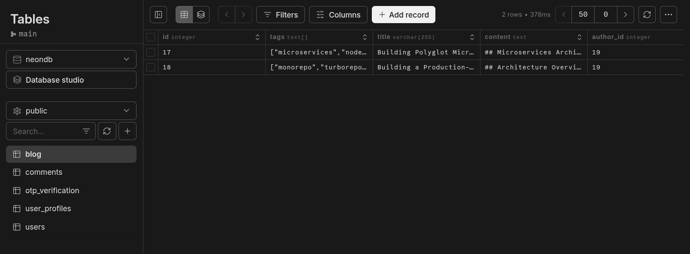

# Final Documentation

## Web Dev Technologies - [Project](https://dhvani-five.vercel.app)

---

## Frontend Overview

Browsers render only **HTML, CSS, and JavaScript**:

* **HTML**: structure/skeleton
* **CSS**: styling
* **JS**: interactivity

Modern tools and frameworks speed up development and enable advanced UI/UX patterns.

---

## Example: Counter Component

**Plain JavaScript**

```html
<div>
  <h1 id="count">0</h1>
  <button id="inc">Increment</button>
  <button id="dec">Decrement</button>
  <button id="reset">Reset</button>
</div>

<script>
const countEl = document.getElementById('count');
let count = 0;

document.getElementById('inc').addEventListener('click', () => {
  count++;
  countEl.textContent = count;
});

document.getElementById('dec').addEventListener('click', () => {
  count--;
  countEl.textContent = count;
});

document.getElementById('reset').addEventListener('click', () => {
  count = 0;
  countEl.textContent = count;
});
</script>
```


**React**

```jsx
import { useState } from 'react';

function Counter() {
  const [count, setCount] = useState(0);

  return (
    <div>
      <h1>{count}</h1>
      <button onClick={() => setCount(count + 1)}>Increment</button>
      <button onClick={() => setCount(count - 1)}>Decrement</button>
      <button onClick={() => setCount(0)}>Reset</button>
    </div>
  );
}

export default Counter;
```

**Svelte**

```svelte
<script>
  let count = 0;

  const increment = () => count++;
  const decrement = () => count--;
  const reset = () => count = 0;
</script>

<div>
  <h1>{count}</h1>
  <button on:click={increment}>Increment</button>
  <button on:click={decrement}>Decrement</button>
  <button on:click={reset}>Reset</button>
</div>
```

**Angular**

```ts
import { Component } from '@angular/core';

@Component({
  selector: 'app-counter',
  template: `
    <div>
      <h1>{{ count }}</h1>
      <button (click)="increment()">Increment</button>
      <button (click)="decrement()">Decrement</button>
      <button (click)="reset()">Reset</button>
    </div>
  `
})
export class CounterComponent {
  count = 0;

  increment() { this.count++; }
  decrement() { this.count--; }
  reset() { this.count = 0; }
}
```

**Vue**

```vue
<template>
  <div>
    <h1>{{ count }}</h1>
    <button @click="increment">Increment</button>
    <button @click="decrement">Decrement</button>
    <button @click="reset">Reset</button>
  </div>
</template>

<script setup>
import { ref } from 'vue';
const count = ref(0);
const increment = () => count.value++;
const decrement = () => count.value--;
const reset = () => count.value = 0;
</script>
```

**Astro**

```astro
---
let count = 0;

const increment = () => count++;
const decrement = () => count--;
const reset = () => count = 0;
---

<div>
  <h1>{count}</h1>
  <button on:click={increment}>Increment</button>
  <button on:click={decrement}>Decrement</button>
  <button on:click={reset}>Reset</button>
</div>
```

> Astro renders **static HTML by default** but allows **partial hydration** for interactivity with React, Svelte, Vue, or plain JS components.

---

## Framework/Library Comparison

| Feature        | React                     | Svelte                            | Angular                        | Vue / Nuxt                      | Astro                                             |
| -------------- | ------------------------- | --------------------------------- | ------------------------------ | ------------------------------- | ------------------------------------------------- |
| Type           | Library                   | Compiler + Framework              | Framework                      | Framework + SSR (Nuxt)          | Static Site Generator + Partial Hydration         |
| DOM Update     | Virtual DOM diffing       | Direct reactive updates           | Real DOM with change detection | Virtual DOM + proxies           | Static HTML + client hydration                    |
| Syntax         | JSX                       | HTML-like templates with JS       | Template syntax + TypeScript   | Template syntax / JSX optional  | Markdown/HTML templates + JS/Framework components |
| Learning Curve | Moderate                  | Easy to moderate                  | Steep                          | Moderate                        | Moderate                                          |
| State          | Hooks / Context           | Reactive variables                | Services + Observables         | Reactive refs / composition API | Uses framework/component state                    |
| Performance    | Efficient via virtual DOM | Very fast due to compiled updates | Slower, real DOM               | Efficient, simpler reactivity   | Extremely fast static pages, JS only where needed |

---

## Summary

Modern frontend frameworks and libraries abstract DOM updates and state management:

* **React**: flexible, virtual DOM, JS-first
* **Angular**: full-featured, real DOM, change detection
* **Svelte**: compiled, minimal runtime, direct DOM updates
* **Vue/Nuxt**: virtual DOM, simple reactive system, SSR via Nuxt
* **Astro**: static-first, partial hydration, minimal JS on client

## Database Overview

Databases are organized collections of data that allow for efficient storage, retrieval, and management of information. They can be broadly categorized into two main types: 

1.) Relational databases (SQL) - MySQL, PostgreSQL
2.) Non-relational databases (NoSQL) - MongoDB, Cassandra

## SQL and How it's stored



```sql
-- Users table
CREATE TABLE public.users (
    id SERIAL PRIMARY KEY,
    email TEXT UNIQUE NOT NULL,
    password TEXT NOT NULL,
    name TEXT NOT NULL,
    is_verified BOOLEAN NOT NULL DEFAULT false,
    created_at TIMESTAMP NOT NULL DEFAULT now(),
    updated_at TIMESTAMP NOT NULL DEFAULT now(),
    profile_image VARCHAR(500)
);

-- Blog table
CREATE TABLE public.blog (
    id INTEGER PRIMARY KEY GENERATED ALWAYS AS IDENTITY,
    tags TEXT[],
    title VARCHAR(255) NOT NULL,
    content TEXT NOT NULL,
    author_id INTEGER NOT NULL,
    created_at TIMESTAMP NOT NULL DEFAULT now(),
    updated_at TIMESTAMP NOT NULL DEFAULT now(),
    image VARCHAR(500),
    order_id INTEGER NOT NULL,
    CONSTRAINT blog_author_id_users_id_fk FOREIGN KEY (author_id) REFERENCES public.users(id) ON DELETE CASCADE
);

-- Comments table
CREATE TABLE public.comments (
    id INTEGER PRIMARY KEY GENERATED ALWAYS AS IDENTITY,
    user_id INTEGER NOT NULL,
    blog_id INTEGER NOT NULL,
    content VARCHAR(500) NOT NULL,
    created_at TIMESTAMP NOT NULL DEFAULT now(),
    CONSTRAINT comments_user_id_users_id_fk FOREIGN KEY (user_id) REFERENCES public.users(id) ON DELETE CASCADE,
    CONSTRAINT comments_blog_id_blog_id_fk FOREIGN KEY (blog_id) REFERENCES public.blog(id) ON DELETE CASCADE
);

-- OTP Verification table
CREATE TABLE public.otp_verification (
    email VARCHAR(255) PRIMARY KEY,
    otp_hash VARCHAR(255) NOT NULL,
    expires_at TIMESTAMP NOT NULL,
    created_at TIMESTAMP NOT NULL DEFAULT now()
);

-- Indexes
CREATE UNIQUE INDEX blog_pkey ON public.blog USING BTREE(id);
CREATE UNIQUE INDEX users_email_unique ON public.users(email);
CREATE UNIQUE INDEX comments_pkey ON public.comments USING BTREE(id);
CREATE UNIQUE INDEX otp_verification_pkey ON public.otp_verification(email);
```

## NoSQL and How it's stored


```go
type Project struct {
 mgm.DefaultModel  `bson:",inline" json:"inline"`
 Order             int      `bson:"order" json:"order"`
 Skills            []string `bson:"skills" json:"skills"`
 Description       string   `bson:"description" json:"description"`
 ProjectName       string   `bson:"project_name" json:"project_name"`
 ProjectVideo      string   `bson:"project_video" json:"project_video"`
 ProjectLiveLink   string   `bson:"project_live_link" json:"project_live_link"`
 SmallDescription  string   `bson:"small_description" json:"small_description"`
 ProjectRepository string   `bson:"project_repository" json:"project_repository"`
}
```

## Backend Overview

Backend development involves creating the **server-side logic** that connects the frontend to the database and handles core application functionality. Key responsibilities include:

* Implementing **business logic** (calculations, validations, workflows).
* Creating **APIs** for communication (REST, GraphQL, RPC, gRPC).
* Managing **data persistence** and retrieval from databases.
* Ensuring **security**, authentication, and authorization.
* Handling **scalability, performance, and error handling**.

**Technology considerations:**

* **JavaScript/Node.js**: Easy to learn, rich library ecosystem, high developer productivity, moderate performance.
* **Go**: Concurrency-friendly, simple syntax, good performance for network-heavy apps.
* **Rust**: High performance, memory-safe, steep learning curve.
* **Python, Java, Ruby, etc.**: Each has frameworks and libraries tailored for backend development.

Choosing a backend tech stack requires weighing **performance, scalability, developer experience, and ecosystem support**.

---

## System Design Overview

System design is the **high-level planning of software architecture** to satisfy functional and non-functional requirements. It defines:

* **Components and modules**
* **Interfaces and APIs**
* **Data models and storage solutions**
* **Interaction patterns and workflows**

Key considerations:

* **Database design**: Optimized schemas, indexing, relationships, and data integrity.
* **Design patterns**: Maintainable and scalable system architecture.
* **Scalability, reliability, and fault tolerance**.

**Example:** Netflix

* Uses **microservices architecture** to break the system into independent, manageable services.
* Each service can be **developed, deployed, and scaled independently**.
* Handles **massive data and traffic efficiently** while ensuring **high availability**.
* Implements **chaos testing** (Chaos Monkey) to intentionally introduce failures, improving **system resilience and reliability**.

Good system design ensures **modularity, performance, scalability, maintainability, and fault tolerance**.